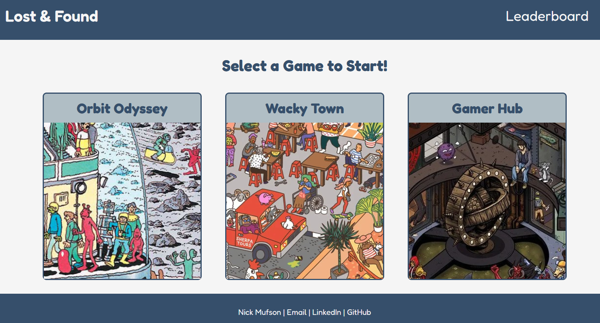
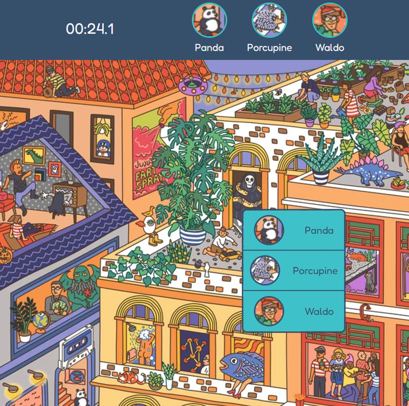
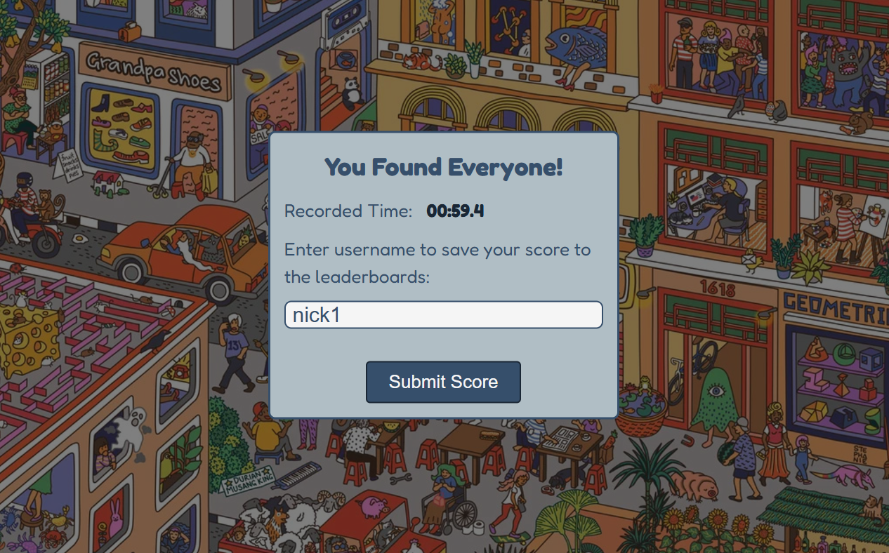
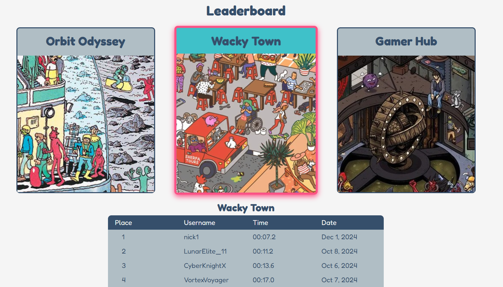

# Lost & Found 

Lost & Found is a full-stack "Where's Waldo" style game featuring a backend that serves game images and character coordinates, and a frontend where players can find characters, compete for record times, and add their scores to the leaderboard.
## Live Demo 
[https://blog-platform-chi-seven.vercel.app/](https://lost-and-found-frontend-plum.vercel.app/)
## Technologies Used
### Frontend
- **React.js**: UI library for building interactive components.
- **React Router**: Manages routing and navigation between pages.
- **Vitest**: Testing library for unit and integration tests.
### Backend
- **Node.js**: Runtime environment for server-side JavaScript.
- **Express.js**: Framework for handling API requests and responses.
### Database
- **PostgreSQL**: Relational database for storing game data.
- **Prisma**: ORM for database management and schema definitions.

## Features

1. **Select a Game**:
    - Select one of the three illustrations to play from: Orbit Odyssey, Wacky Town, or Gamer Hub
    - User will be presented with the three characters they must search for in the image

*Home Page with Game Previews*

2. **Play Game**
    - After pressing 'Start Game,' the timer will begin and the user can begin searching for characters
    - Clicking somewhere on the game illustration opens a menu with characters, allowing the user to choose which character they've found
    - After selecting from the menu, a notification will appear alerting the user if they successfully found the character or not

*Game Illustration Page*

3. **Submit Score**
    - After all characters are found, a modal appears where the user can submit their timed score with their username
  

*Submit Score*

  
4. **Leaderboards**
    - The user will then be brought to the leaderboard page where they can browse high scores across the three games

*Leaderboards*

## API Endpoints

| HTTP Method | Endpoint                     | Description                                                  |
| ----------- | ---------------------------- | ------------------------------------------------------------ |
|             |                              |                                                              |
| GET         | /                            | Retrieves all photos for the home page, including character locations and user scores for each image. |
| GET         | /photo/slug/:slug            | Retrieve data for specific game using its slug. Includes character locations and user scores.                                 |
|             |                              |                                                              |
| POST        | /photo/:photoId/score        | Submits a new user score along with their username to the leaderboard           |

## Database Schema

Our blog application uses PostgreSQL as the database, with Prisma as the ORM. Here's an overview of our data models:

### Photo
- `id`: Int (Primary Key, Auto-increment)
- `image`: String 
- `name`: String
- `slug`: String (Unique, Nullable)
- Relations:
    - Has many characters
    - Has many scores
### Character
- `id`: Int (Primary Key, Auto-increment)
- `name`: String
- `image`: String
- `positionX`: Float (X-coordinate of character within photo)
- `positionY`: Float (Y-coordinate of character within photo)
- `photoId`: Int (Foreign Key)
- Relations:
    - Belongs to one photo
### Score
- `id`: Int (Primary Key, Auto-increment)
- `time`: Float (measured in deciseconds)
- `photoId`: Int (Foreign Key)
- `username`: String 
- `date`: DateTime (Defaults to current timestamp)
- Relations:
    - Belongs to one photo

## Testing

### Testing Libraries
- **Vitest**
- **React Testing Library**
- **@testing-library/jest-dom**

### Test Coverage
- Components and pages are tested for:
  - User interactions (clicks, form inputs, etc.)
  - Conditional rendering
  - Routing behavior

## Contact Info
For questions, suggestions, or feedback, please contact me at:

- Email: [nickmufson1@gmail.com](mailto:nickmufson1@gmail.com)
- LinkedIn: [linkedin.com/in/nicholasmufson](https://www.linkedin.com/in/nicholasmufson/)
